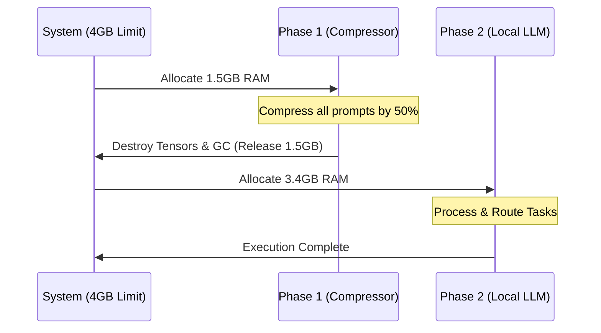
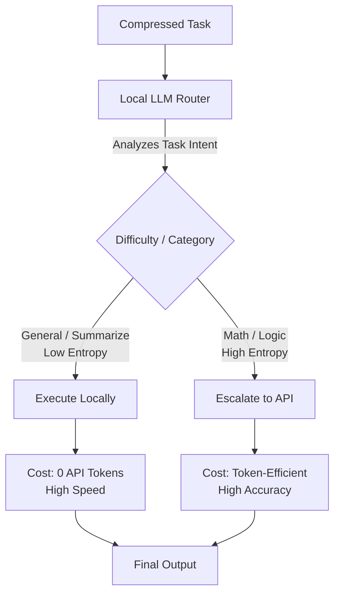

# Hybrid Token-Efficient Routing Agent

Welcome to the **Hybrid Token-Efficient Routing Agent**. This project was engineered specifically to solve two of the biggest challenges in modern AI deployment: **Strict Hardware Constraints (4GB RAM)** and **API Cost Optimization**.

By utilizing a sophisticated, memory-aware 2-phase pipeline, this agent seamlessly routes complex AI tasks between a lightning-fast local LLM and powerful external API models. It ensures zero Out-of-Memory (OOM) crashes while maximizing token efficiency and minimizing costs.

---

## 🎯 Core Concepts & Architecture

Our architecture is built on two primary pillars: **Aggressive Memory Management** and **Dynamic Intent Routing**.

### 1. The 4GB Memory Bottleneck
The strict 4GB RAM limit imposed by standard edge devices (and hackathon judging containers) makes it seemingly impossible to run a high-quality local LLM alongside a prompt-compression model simultaneously. Loading both would instantly exceed the memory limit and crash the system.

### 2. Our Solution: 2-Phase Sequential Memory Management
To solve this, our agent employs a **2-Phase Sequential Architecture** heavily reliant on aggressive Python garbage collection and tensor destruction.



1. **Phase 1 (Prompt Compression):** The pipeline first loads the 1.5 GB `LLMLingua-2` model into memory. It reads the tasks, scores token importance, and aggressively compresses long prompts. Once finished, the pipeline actively destroys the global PyTorch tensors and runs the Garbage Collector, forcefully returning the 1.5 GB of RAM back to the OS.
2. **Phase 2 (Local Engine & Routing):** With a completely flushed RAM environment, the local LLM safely loads into memory.

### 3. Dynamic Intent-Based Routing
Once the local LLM is loaded, it doesn't just blindly answer questions. It acts as an intelligent **Router**. 



If a task is standard (like summarization or data extraction), it answers it locally for **0 API cost**. If a task requires heavy reasoning (like advanced mathematics) or generates high output entropy, it seamlessly escalates the request to the Fireworks AI API. This ensures you only pay for API tokens when absolutely necessary!

---

## 🚀 How to Run the Agent

You can run this project locally via source code or use the fully containerized Docker image.

### Option 1: Run Locally (Source Code)

If you want to run the agent locally, you can set up and use the environment in whatever way you prefer.

#### 1. Prerequisites
- **Python 3.10+**
- **Fireworks API Key**

#### 2. Installation
Clone the repository and install the optimized dependencies:
```bash
git clone https://github.com/jackso1328/Hybrid-Token-Efficient-Routing-Agent.git
cd Hybrid-Token-Efficient-Routing-Agent
pip install -r requirements.txt
```

#### 3. Configuration
Create a `.env` file in the root directory and add the required hackathon variables:
```env
FIREWORKS_API_KEY=your_api_key_here
FIREWORKS_BASE_URL=https://api.fireworks.ai/inference/v1
ALLOWED_MODELS=accounts/fireworks/models/gemma-4-26b-a4b-it
```

#### 4. Execution
Run the batch processing script. It will read `input/tasks.json` and beautifully format the final answers into `output/results.json`:
```bash
python src/main.py
```

---

### Option 2: Run via Docker (Live API Backend)

The project is fully configured to run as a **Live Backend API** inside a strict 2 vCPU / 4GB RAM Docker container.

#### 1. Build the Docker Image
```bash
docker build -t hybrid-routing-agent .
```

#### 2. Run the Container
Launch the container in detached mode, exposing the live backend on port `8000`, while strictly enforcing the hackathon's resource limits. 

**Important:** You must add your Fireworks API key. You can either use your `.env` file, or pass the key directly in the command:

```bash
# If using your .env file:
docker run -d -p 8000:8000 --cpus="2.0" --memory="4g" --env-file .env hybrid-routing-agent

# OR, pass your Fireworks API key directly:
docker run -d -p 8000:8000 --cpus="2.0" --memory="4g" -e FIREWORKS_API_KEY="your_api_key_here" -e ALLOWED_MODELS="accounts/fireworks/models/gemma-4-26b-a4b-it" hybrid-routing-agent
```

#### 3. Test the Live Backend
Once the container is running, the API is live at `http://localhost:8000`. You can test it by sending a POST request to `/solve`:
```bash
curl -X POST "http://localhost:8000/solve" \
     -H "Content-Type: application/json" \
     -d '{"task_id": "demo-01", "prompt": "If a train travels 60mph for 2 hours, how far does it go?"}'
```

---
*Built for the AMD Developer Hackathon.*
